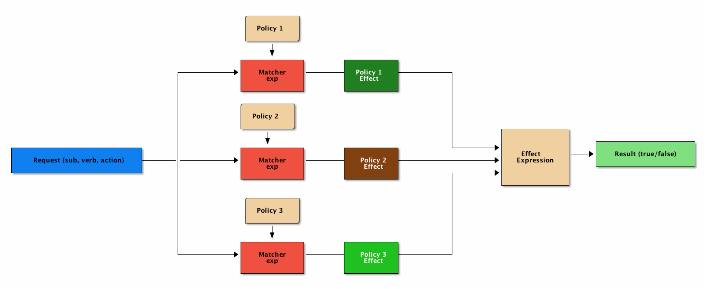

# casbin - 权限管理

[casbin官网](https://casbin.org/docs/zh-CN/overview)  
[casbin github](https://github.com/casbin/casbin)

---

[学习参考链接](https://www.cnblogs.com/wang_yb/archive/2018/11/20/9987397.html)

## 一. PERM 模型

> PERM(Policy, Effect, Request, Matchers)模型很简单, 但是反映了权限的本质 – 访问控制

- Policy: 策略,定义权限的规则
- Effect: 效果,定义组合了多个Policy之后的结果, allow/deny
- Request: 请求,也就是 谁想操作什么资源
- Matcher: 匹配器,判断Request是否满足 Policy



## 二.casbin权限库

> casbin 使用了PERM模型来表达权限, 并且提供了简单直接的 API.

### 1. 核心概念

#### model file

> 用来定义具体的权限模型,目前支持的模型基本覆盖了常见的所有场景:

- ACL  
- ACL with superuser
- ACL without users
- ACL without resources
- RBAC
- RBAC with resource roles
- RBAC with domains/tenants
- ABAC

#### model file 语法

> casbin 是基于 PERM 的, 所有 model file 中主要就是定义 PERM 4 个部分.

##### 1. Request definition

> 简单理解: 访问请求的 谁,资源,操作方法(见上图) who act what

```conf
    [request_definition]
    r = sub, obj, act
```

分别表示 request 中的:

- accessing entity (Subject): 主体(who)
- accessed resource (Object): 资源(what)
- the access method (Action): 方法(act)

##### 2. Policy definition

> 简单理解: 定义权限的规则,使用权限规则由macher来定义

```conf
[policy_definition]
p = sub, obj, act
p2 = sub, act
```

定义的每一行称为 policy rule, 其中p,p2是policy rule的名字.

- p 定义的是sub对obj资源进行act.
- p2 定义的是sub所有的资源都能执行act.

##### 3. Policy effect

> 简单理解: p.eft是由macher得来的,判断allow还是deny

```conf
[policy_effect]
e = some(where (p.eft == allow))
```

上面表示有任意一条policy rule 满足,则最终结果为allow

##### 4. Matchers

> 简单理解: 相当于定义了一个匹配的方法 p.eft = request.machers(policy)

```conf
[matchers]
m = r.sub == p.sub && r.obj == p.obj && r.act == p.act
```

定义了request和policy匹配的方法, p.eft 是allow还是deny, 就是基于此来决定的

##### 5. Role

```conf
[role_definition]
g = _, _
g2 = _, _
g3 = _, _, _
```

- g, g2, g3 表示不同的 RBAC 体系,
- _,_ 表示用户和角色
- _,_,_ 表示用户,角色,域(也就是租户)


#### policy file

> 定义具体的策略, 权限的检查就是基于定义的model file和policy file 来完成的.
> 相对于 model file 定义规则, policy file 中定义的就是具体的内容.